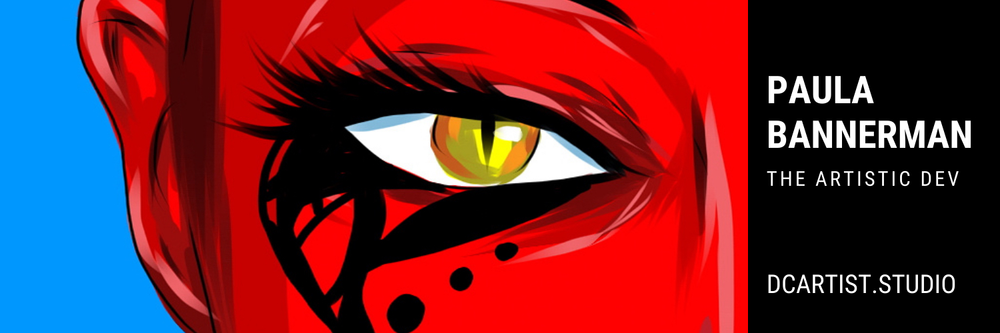

### 

# Paula Bannerman  

The Artistic Developer

------

### To me programming is another art form that people can use.

## 🛠️ Skills

### Languages
<table>
  <tr>
    <td align="center"><a href="https://www.python.org/"> Python</a></td>
    <td align="center"><a href="https://developer.mozilla.org/en-US/docs/Web/JavaScript"> JavaScript</a></td>
    <td align="center"><a href="https://www.php.net/"> PHP</a></td>
    <td align="center"><a href="https://www.ruby-lang.org/en/"> Ruby</a></td>
  </tr>
</table>

### Frontend
<table>
  <tr>
    <td align="center"><a href="https://developer.mozilla.org/en-US/docs/Glossary/HTML5"> HTML5</a></td>
    <td align="center"><a href="https://www.w3.org/TR/CSS/#css"> CSS3</a></td>
    <td align="center"><a href="https://reactjs.org/"> React</a></td>
    <td align="center"><a href="https://angular.io/"> Angular</a></td>
    <td align="center"><a href="https://getbootstrap.com/"> Bootstrap</a></td>
    <td align="center"><a href="https://tailwindcss.com/"> TailwindCSS</a></td>
  </tr>
  <tr>
    <td align="center"><a href="https://sass-lang.com/"> Sass</a></td>
    <td align="center"><a href="https://jquery.com/"> jQuery</a></td>
    <td align="center"><a href="https://mui.com/"> Material UI</a></td>
    <td align="center"><a href="https://webpack.js.org/"> Webpack</a></td>
  </tr>
</table>

### Backend & Databases
<table>
  <tr>
    <td align="center"><a href="https://nodejs.org/en/"> NodeJS</a></td>
    <td align="center"><a href="https://expressjs.com/"> Express</a></td>
    <td align="center"><a href="https://www.djangoproject.com/"> Django</a></td>
    <td align="center"><a href="https://flask.palletsprojects.com/en/2.0.x/"> Flask</a></td>
    <td align="center"><a href="https://laravel.com/"> Laravel</a></td>
    <td align="center"><a href="https://graphql.org/"> GraphQL</a></td>
  </tr>
  <tr>
    <td align="center"><a href="https://www.mysql.com/"> MySQL</a></td>
    <td align="center"><a href="https://www.mongodb.com/"> MongoDB</a></td>
    <td align="center"><a href="https://www.postgresql.org/"> PostgreSQL</a></td>
    <td align="center"><a href="https://www.heroku.com/"> Heroku</a></td>
  </tr>
</table>

### Design Tools
<table>
  <tr>
    <td align="center"><a href="https://www.adobe.com/uk/products/photoshop.html"> Photoshop</a></td>
    <td align="center"><a href="https://adobe.com/uk/products/illustrator.html"> Illustrator</a></td>
    <td align="center"><a href="https://www.adobe.com/uk/products/aftereffects.html"> After Effects</a></td>
    <td align="center"><a href="https://www.adobe.com/uk/products/premiere.html"> Premiere Pro</a></td>
    <td align="center"><a href="https://www.adobe.com/uk/products/xd.html"> XD</a></td>
    <td align="center"><a href="https://www.figma.com/"> Figma</a></td>
  </tr>
  <tr>
    <td align="center"><a href="https://www.sketch.com/"> Sketch</a></td>
  </tr>
</table>

### **Contact:** 

------

- Email me: thedcdeveloper@gmail.com 
- Website: https://www.dcartist.studio
- LinkedIn: https://www.linkedin.com/in/dcartist/
- Twitter: https://twitter.com/dcartist

------

